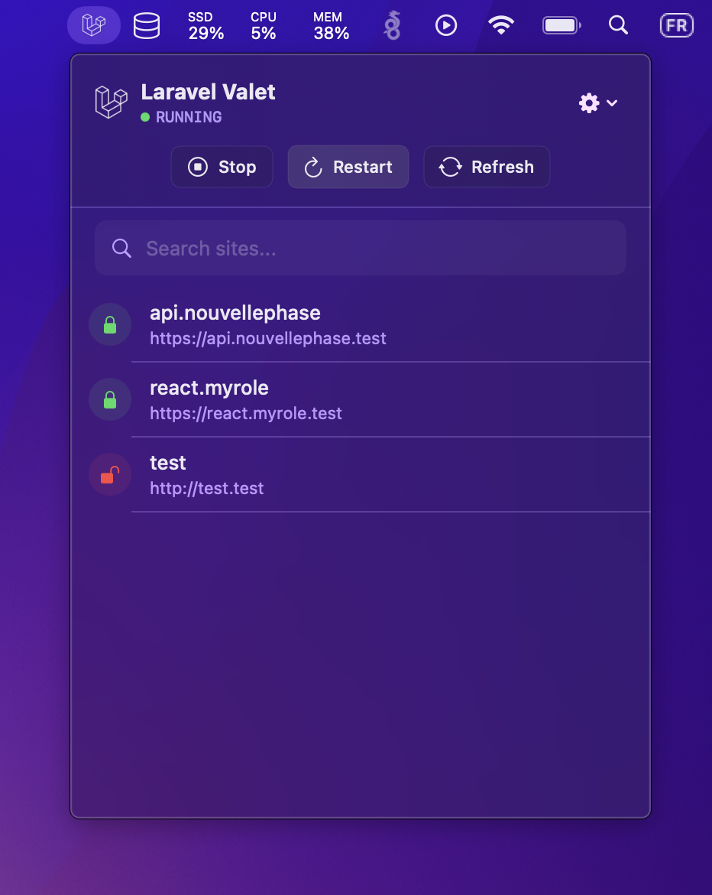

  

  # ValetBar 🐦

  **The missing native companion for Laravel Valet on macOS.**

  
  
  
  

   

  **ValetBar** lives in your menu bar, giving you instant control over your local request cycle.
  Stop wrestling with the terminal for status checks. Monitor your sites, toggle services, and debug in style.

  [Download Latest Release](https://github.com/ryzenixx/valetbar-macos/releases/latest) • [Report Bug](https://github.com/ryzenixx/valetbar-macos/issues) • [Request Feature](https://github.com/ryzenixx/valetbar-macos/issues)

---

## ✨ Features

- **Instant Control** — Start, Stop, and Restart Valet services (Nginx, PHP, DnsMasq) in one click.
- **Site Management** — View all your parked `.test` domains with live SSL status indicators.
- **Native Experience** — Built with SwiftUI and `NSVisualEffectView` for that premium macOS feel.
- **Quick Actions** — Instant browser navigation for any local site.

## 🛠 Under the Hood

ValetBar is built with **Swift 6.2.3** and **SwiftUI**, adhering to the highest standards of macOS development.
It includes **Sparkle 2** for secure, sandboxed auto-updates and is fully signed with the **Hardened Runtime**.

## 🚀 Installation

### Recommended
1. Go to the [Releases Page](https://github.com/ryzenixx/valetbar-macos/releases/latest).
2. Download `ValetBar.dmg`.
3. Drag the app to your **Applications** folder.
4. Launch it! 🚀

## 🤝 Contributing

We welcome contributions! Please see our [CONTRIBUTING.md](https://github.com/ryzenixx/valetbar-macos?tab=contributing-ov-file) for details on how to build the project from source and submit pull requests.

## 📄 License

Distributed under the MIT License. See `LICENSE` for more information.

---

  
Built with ❤️ by Mael Duret

  
<i>Not affiliated with Laravel or the Laravel Valet team.</i>

